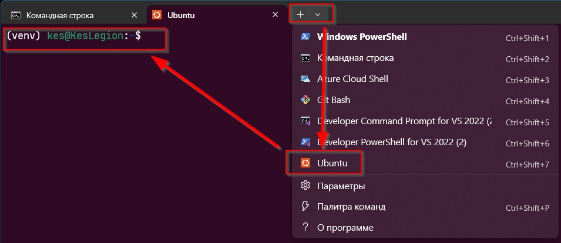
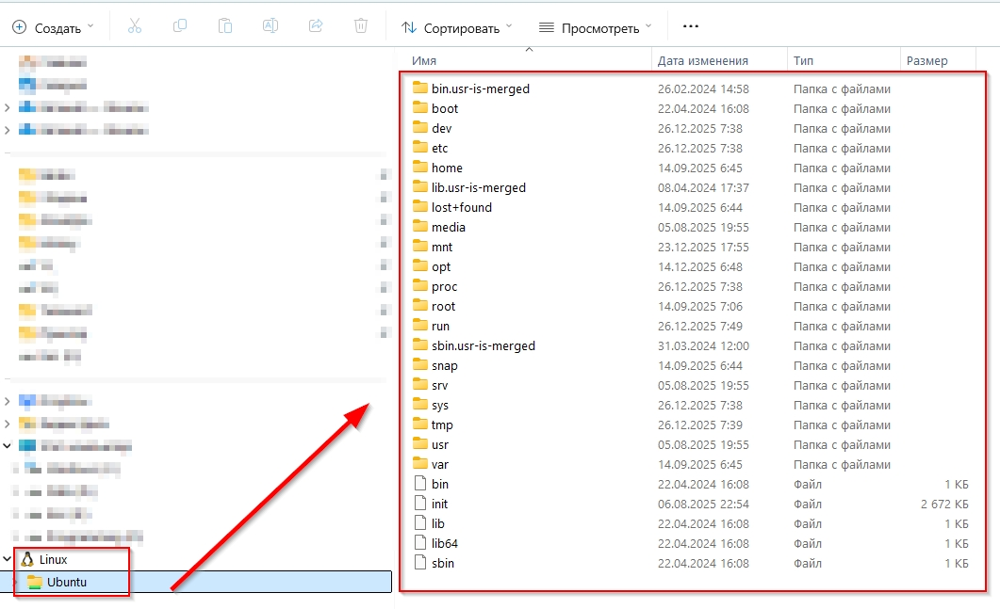
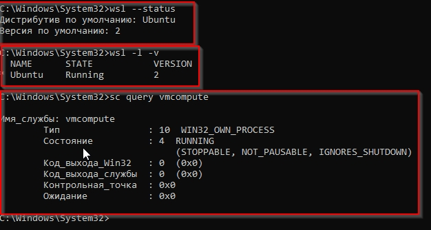

## Проверка WSL

Проект использует **Apache Airflow**, запущенный внутри **WSL2 (Ubuntu)** на Windows.  
Для работы с проектом предполагается, что Airflow развёрнут и запускается именно в этом окружении.

WSL считается корректно настроенным, если выполняются следующие условия:

- Ubuntu успешно запускается **через командную строку Windows**  
  (в терминале внизу доступен выбор профиля **Ubuntu**)

  

- В проводнике Windows отображается диск **Linux** с иконкой пингвина  
  (доступ к файловой системе WSL)

  

Пример корректного состояния WSL  
(проверка выполняется командой `wsl --status`):

---

## Check WSL

This project uses **Apache Airflow** running inside **WSL2 (Ubuntu)** on Windows.  
All development and DAG execution are designed to work in this environment.

WSL is considered correctly configured if the following conditions are met:

- Ubuntu can be successfully launched **from the Windows command line**  
  (the **Ubuntu** terminal profile is available in the dropdown)

  

- A **Linux filesystem drive** with a penguin icon is visible in Windows Explorer  
  (WSL filesystem is accessible)

  

Example of a correct WSL state  
(verified using the `wsl --status` command):

